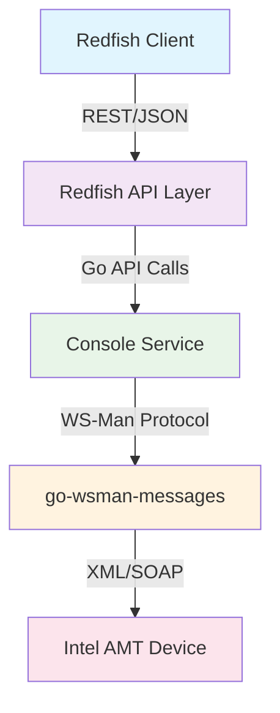
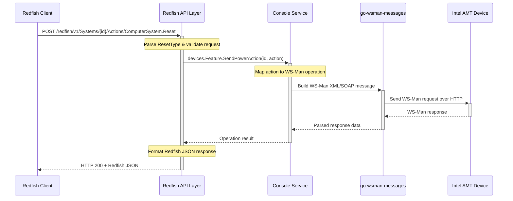

# Redfish Power Management PoC

This project demonstrates a minimal Redfish-compliant REST API for power management of systems managed by Intel AMT, using WS-Man under the hood. It integrates with the existing console service and the go-wsman-messages library.

## Table of Contents

- [Overview](#overview)
- [Architecture](#architecture)
- [Getting Started](#getting-started)
- [API Reference](#api-reference)
- [Examples](#examples)


## Overview

This poc provides a Redfish API layer for Intel AMT power management operations. Built on top of the existing console service infrastructure, it translates standard Redfish REST calls into WS-Management protocol communications with Intel AMT devices.

## Architecture

### System Architecture



### Component Responsibilities

| Component | Responsibility |
|-----------|---------------|
| **Redfish Client** | Standard Redfish REST API consumer (curl, Postman, management tools) |
| **Redfish API Layer** | Gin-based REST endpoints implementing Redfish specification |
| **Console Service** | Business logic layer for device management operations |
| **go-wsman-messages** | WS-Management protocol library for XML/SOAP communication |
| **Intel AMT Device** | Target managed system endpoint |

### Sequence Flow



---

## Key Endpoints

- `GET /redfish/v1/`  
  Returns the Redfish Service Root.

- `GET /redfish/v1/Systems`  
  Returns a collection of managed systems.

- `GET /redfish/v1/Systems/{id}`  
  Returns details for a specific system, including its power state.

- `POST /redfish/v1/Systems/{id}/Actions/ComputerSystem.Reset`  
  Changes the power state of the specified system.

---

## How the Library Handles Protocol Translation

- The **Redfish API Layer** receives REST requests and parses the JSON payload.
- It maps Redfish actions (like `"ForceOff"`) to internal enums or constants.
- The **Console Service** translates these actions into WS-Man protocol operations, calling the appropriate methods in the `go-wsman-messages` library.
- The **go-wsman-messages** library constructs WS-Man-compliant XML/SOAP messages and parses responses.
- All WS-Man protocol details (namespaces, selectors, SOAP envelopes) are encapsulated in the library, so the API and Console layers remain clean and focused on business logic.
- The **Intel AMT Device** executes the WS-Man command and returns the result, which is translated back up the stack to a Redfish-compliant JSON response.

---

## Getting Started

### Prerequisites

- Go 1.21 or later
- Access to Intel AMT-enabled devices
- Existing console service infrastructure

### Installation

Follow the steps as README.md
## Running the Service

```bash
go run ./cmd/app/main.go --config "./config/config.yml"
```

## API Reference

### Systems Collection

```http
GET /redfish/v1/Systems
```

Returns a collection of all managed systems.

### System Instance

```http
GET /redfish/v1/Systems/{systemId}
```

Returns detailed information about a specific system including power state.

### Power Management

```http
POST /redfish/v1/Systems/{systemId}/Actions/ComputerSystem.Reset
Content-Type: application/json

{
  "ResetType": "ForceOff"
}
```

Executes power management operations on the target system.

## Power State Mapping

| Redfish ResetType | Console Action | WS-Man PowerState | Description |
|------------------|---------------|-------------------|-------------|
| `On` | Power Up | `2` | Power on the system |
| `ForceOff` | Power Down | `8` | Immediate power off |
| `ForceRestart` | Reset | `10` | Hard reset |
| `PowerCycle` | Power Cycle | `5` | Power cycle operation |
| `GracefulShutdown` | Soft Power Off | `12` | Graceful shutdown |

## Examples

## Authorization

```bash
 curl -s -X POST http://localhost:8181/api/v1/authorize   -H "Content-Type: application/json"   -d "{\"username\":\"$API_USERNAME\",\"password\":\"$API_PASSWORD\"}"

```

## Get Session Service

```bash
 curl -X GET http://localhost:8181/api/redfish/v1/SessionService   -H "Authorization: Bearer $AUTH_TOKEN"
```

## Get Metadata

```bash
 curl -X GET http://localhost:8181/api/redfish/v1/$metadata   -H "Authorization: Bearer $AUTH_TOKEN"
```

## Get System details

 ```bash
 curl -X GET http://localhost:8181/api/redfish/v1/Systems   -H "Authorization: Bearer $AUTH_TOKEN"
```

## Get System details with ID

```bash
curl -X GET http://localhost:8181/api/redfish/v1/Systems/a1e2ecd6-8e22-4cb7-90a0-0e0f75484e8b   -H "Authorization: Bearer $AUTH_TOKEN"
```

### Basic Power Operations

#### Power Off System

```bash
 curl -X POST http://localhost:8181/api/redfish/v1/Systems/{id}/Actions/ComputerSystem.Reset   -H "Authorization: Bearer $AUTH_TOKEN"   -H "Content-Type: application/json"   -d '{"ResetType":"ForceOff"}'
```

#### Power On System

```bash
 curl -X POST http://localhost:8181/api/redfish/v1/Systems/{id}/Actions/ComputerSystem.Reset   -H "Authorization: Bearer $AUTH_TOKEN"   -H "Content-Type: application/json"   -d '{"ResetType":"On"}''
```
