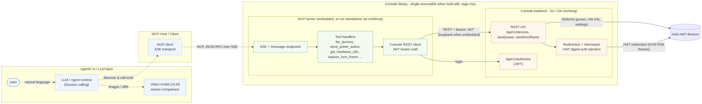

# Console MCP Server (SSE)

An [MCP](https://modelcontextprotocol.io) server that exposes the Device
Management Toolkit **Console** REST API as MCP tools over an **SSE**
(Server-Sent Events) transport. Point any MCP client (e.g. an LLM agent) at it
to list and manage AMT devices through Console.

It can run **two ways** (see [Build options](#build-options)):

- **Embedded** — compiled into the Console binary (`-tags mcp`) for a single
  self-contained executable that serves Console *and* the MCP server.
- **Standalone** — a separate `cmd/mcp` process that talks to any Console over
  REST.

The default Console build excludes the MCP server entirely, so a Console-only
binary is unaffected.

## How it works

```
              (embedded: same process, -tags mcp)
              ┌───────────────────────────────────┐
MCP client ──SSE──▶ Console MCP server ──REST(JWT)──▶ Console backend ──▶ AMT devices
              └───────────────────────────────────┘
                  (standalone: separate process)
```

The server authenticates to Console with the configured username/password
(`POST /api/v1/authorize`), caches the JWT, and re-authenticates automatically
if the token expires. When embedded it auto-wires to its own Console instance
and reuses the admin credentials.

See **[docs/ARCHITECTURE.md](docs/ARCHITECTURE.md)** for the full architecture
diagram (dotted lines = agentic AI connections, solid lines = API/operation
interfaces):

[](docs/ARCHITECTURE.md)

## Configuration

All configuration is via environment variables:

| Variable | Default | Description |
| --- | --- | --- |
| `CONSOLE_BASE_URL` | `https://localhost:8181` | Base URL of the Console backend. |
| `CONSOLE_USERNAME` | _(required)_ | Console login username. |
| `CONSOLE_PASSWORD` | _(required)_ | Console login password. |
| `CONSOLE_INSECURE_SKIP_VERIFY` | `true` | Skip TLS verification (Console ships a self-signed cert by default). |
| `CONSOLE_REQUEST_TIMEOUT_SECONDS` | `30` | Per-request timeout to the Console backend. |
| `MCP_ADDR` | `:8080` | Address the SSE server binds to. |
| `MCP_BASE_URL` | `http://localhost:8080` | Public base URL advertised to SSE clients. |
| `MCP_ENABLED` | `true` | Embedded build only: set `false` to keep the MCP server off at runtime. |

Copy [.env.example](.env.example) and fill in your credentials.

## Build options

The MCP server can run **as a standalone process** or be **compiled into the
Console binary** behind the `mcp` build tag. All commands run from
`space_1/console`.

| Goal | Command | Output |
| --- | --- | --- |
| Console only (MCP **excluded**) | `make build` / `go build ./cmd/app` | `bin/console` |
| Single binary: Console **+ embedded MCP** | `make build-mcp` / `go build -tags mcp ./cmd/app` | `bin/console-mcp` |
| Standalone MCP server | `make build-mcp-standalone` / `go build ./cmd/mcp` | `bin/mcp` |
| Windows (combined + standalone) | `make build-mcp-windows` | `dist/windows/console-mcp_windows_x64.exe`, `dist/windows/mcp_windows_x64.exe` |

The default Console build does **not** link the MCP dependency at all — the `mcp`
tag is what pulls it in, so a Console-only binary is unaffected.

Cross-compile a Windows combined binary directly:

```sh
CGO_ENABLED=0 GOOS=windows GOARCH=amd64 go build -tags mcp -ldflags "-s -w" -trimpath -o console-mcp.exe ./cmd/app
```

### Embedded mode

When built with `-tags mcp`, Console starts the MCP SSE server in-process and
**auto-wires** it to itself: `CONSOLE_BASE_URL` defaults to this instance
(`127.0.0.1:<HTTP_PORT>`, https when TLS is on) and it reuses the Console admin
credentials (`AUTH_ADMIN_USERNAME` / `AUTH_ADMIN_PASSWORD`) unless you override
`CONSOLE_USERNAME` / `CONSOLE_PASSWORD`. Set `MCP_ENABLED=false` to keep it off.

```sh
# Run Console with the embedded MCP server
make run-mcp
```

## Run (standalone)

```sh
cd space_1/console

# Set the Console credentials the MCP server logs in with (PowerShell)
$env:CONSOLE_USERNAME = "admin"
$env:CONSOLE_PASSWORD = "<your-password>"

go run ./cmd/mcp
```

The server prints its endpoints on startup:

- SSE endpoint: `http://localhost:8080/sse`
- Message endpoint: `http://localhost:8080/message`

## Integrating agentic AI / LLMs

This server speaks the **Model Context Protocol (MCP)**, so any MCP-capable LLM
agent can discover and call the tools below in natural language. The agent
connects over the **SSE** transport, the runtime fetches the tool list +
JSON-Schemas automatically, and the LLM decides which tool to call to satisfy a
user request.

```
User ⇄ LLM/agent  ──MCP (SSE)──▶  Console MCP server  ──REST──▶  Console ⇄ AMT devices
```

### 1. Start the server

Follow [Run](#run) so the SSE endpoint is live at
`http://localhost:8080/sse`. Keep it running while the agent is connected.

### 2. Connect your client

Pick the entry that matches your host. Anything that natively supports a **remote
/ SSE** MCP server points straight at the URL; stdio-only hosts use the
`mcp-remote` bridge.

**VS Code (GitHub Copilot agent)** — create `.vscode/mcp.json`:

```json
{
  "servers": {
    "console": { "type": "sse", "url": "http://localhost:8080/sse" }
  }
}
```

Then open the Chat view, switch to **Agent** mode, and the `console` tools appear
in the tools picker.

**Cursor / Windsurf** — in the MCP settings add a server with:

```json
{
  "mcpServers": {
    "console": { "url": "http://localhost:8080/sse" }
  }
}
```

**Claude Desktop (and other stdio-only hosts)** — bridge SSE to stdio with
[`mcp-remote`](https://www.npmjs.com/package/mcp-remote) in
`claude_desktop_config.json`:

```json
{
  "mcpServers": {
    "console": {
      "command": "npx",
      "args": ["-y", "mcp-remote", "http://localhost:8080/sse"]
    }
  }
}
```

### 3. Build a custom agent (LLM + tools loop)

If you are wiring your own agent, connect an MCP client to the SSE endpoint, hand
the tool schemas to your LLM as function/tool definitions, and execute the tool
calls the model returns.

**Python** (official `mcp` SDK + any function-calling LLM):

```python
import asyncio
from mcp import ClientSession
from mcp.client.sse import sse_client

async def main():
    async with sse_client("http://localhost:8080/sse") as (read, write):
        async with ClientSession(read, write) as session:
            await session.initialize()

            # 1. Discover tools and convert to your LLM's tool/function schema.
            tools = (await session.list_tools()).tools
            llm_tools = [
                {"type": "function",
                 "function": {"name": t.name,
                              "description": t.description,
                              "parameters": t.inputSchema}}
                for t in tools
            ]

            # 2. Give `llm_tools` to your LLM. When it asks to call a tool:
            result = await session.call_tool("list_devices", {"top": 25})
            print(result.content[0].text)

asyncio.run(main())
```

Feed `llm_tools` into your chat-completions call, and whenever the model emits a
tool call, run `await session.call_tool(name, arguments)` and return the text
result as the tool message — a standard agent loop.

**TypeScript** (`@modelcontextprotocol/sdk`):

```ts
import { Client } from '@modelcontextprotocol/sdk/client/index.js'
import { SSEClientTransport } from '@modelcontextprotocol/sdk/client/sse.js'

const client = new Client({ name: 'console-agent', version: '1.0.0' })
await client.connect(new SSEClientTransport(new URL('http://localhost:8080/sse')))

const { tools } = await client.listTools()           // pass to your LLM
const res = await client.callTool({ name: 'get_power_state', arguments: { guid } })
```

### 4. Recommended system prompt

Give the agent enough domain context to choose tools well:

> You manage Intel AMT devices through the Console MCP tools. Identify devices
> with `list_devices`/`get_device` (always by `guid`). Before any power change,
> confirm the current state with `get_power_state`, then use `send_power_action`
> with the correct numeric code (2=On, 8=Off, 10=Reset). For screen inspection
> use `capture_kvm_frame`. Never invent a `guid` — look it up first, and confirm
> destructive power actions with the user.

### 5. Example prompts

- "List all connected devices and show their power state."
- "Reset the device named `lab-pc-3`." → `list_devices` → `send_power_action` (10).
- "What CPU and memory does device `<guid>` report?" → `get_hardware_info`.
- "Compare the screen of `<guid>` now vs. 5 seconds from now and tell me what
  changed." → two `capture_kvm_frame` calls (see the VLM workflow below).

### 6. Vision (VLM) screen-comparison workflow

`capture_kvm_frame` returns a **raw** framebuffer (no server-side rendering), so
a vision-capable model or your agent decodes it into an image first. Typical
loop:

1. Call `capture_kvm_frame` for the `guid` → get `width`, `height`, `dataBase64`.
2. Decode the RGB332 bytes into a PNG (see snippet below).
3. Repeat after a delay for a second frame.
4. Send both PNGs to a VLM: *"Compare these two screenshots and describe any
   differences."*

```python
import base64
from PIL import Image  # pip install pillow

def rgb332_to_png(frame: dict, path: str):
    raw = base64.b64decode(frame["dataBase64"])
    w, h = frame["width"], frame["height"]
    img = Image.new("RGB", (w, h))
    px = [((b >> 5) * 255 // 7, ((b >> 2) & 7) * 255 // 7, (b & 3) * 255 // 3)
          for b in raw]
    img.putdata(px)
    img.save(path)
```

> Security: the agent inherits the Console permissions of the configured
> `CONSOLE_USERNAME`. Run the MCP server on a trusted host/network, prefer a
> least-privilege Console account, and require user confirmation for power
> actions and redirection sessions.

## Tools

| Tool | Description |
| --- | --- |
| `list_devices` | List devices; optional `hostname`, `friendlyName`, `tags`, `top`, `skip`. |
| `get_device` | Get a single device by `guid`. |
| `get_device_stats` | Total / connected / disconnected device counts. |
| `get_power_state` | Current AMT power state for a `guid`. |
| `get_power_capabilities` | Supported power actions for a `guid`. |
| `send_power_action` | Send a power `action` (see codes below) to a `guid`. |
| `get_hardware_info` | AMT hardware inventory for a `guid`. |
| `get_disk_info` | AMT disk information for a `guid`. |
| `get_general_settings` | AMT general settings for a `guid`. |
| `get_amt_version` | AMT firmware/version info for a `guid`. |
| `get_redirect_status` | KVM/SOL/IDER redirection status for a `guid`. |
| `get_kvm_screen_settings` | KVM display settings for a `guid`. |
| `create_redirection_session` | Create a KVM/SOL redirection token + relay WebSocket URL. |
| `capture_kvm_frame` | Capture one KVM screen frame as raw RGB332 pixels for a VLM/agent to analyse. |

### Power action codes

`2` Power On · `5` Power Cycle (Off Soft) · `6` Power Off (Hard) ·
`8` Power Off (Soft) · `9` Power Cycle (Off Hard) · `10` Reset (Master Bus
Reset) · `11` Diagnostic Interrupt (NMI) · `12` Power Off (Soft Graceful) ·
`13` Power Off (Hard Graceful) · `14` Reset Graceful.

### KVM / SOL sessions

KVM and SOL are interactive WebSocket redirection streams, not request/response
calls, so `create_redirection_session` returns everything a client needs to open
the stream itself:

- `token` — short-lived redirection JWT (bound to the device GUID).
- `relayWebSocket` — e.g. `wss://localhost:8181/relay/webrelay.ashx?host=<guid>&mode=kvm`.

Open the WebSocket and pass the `token` as the `Sec-Websocket-Protocol`
subprotocol header.

### KVM frame capture for a VLM

`capture_kvm_frame` gives an agent/VLM a still of a device screen **without
needing the Console UI** (works in both headless and non-headless Console).

Console drives a one-shot KVM redirection session server-side — reusing its
existing AMT redirection handshake + digest-auth injection — completes the RFB
(VNC) handshake, requests a single full-screen framebuffer, and returns it as
**raw** pixels. No image is rendered server-side; the agent decodes it.

Response fields:

- `width`, `height` — screen dimensions in pixels.
- `pixelFormat` = `RGB332`, `bytesPerPixel` = `1`.
- `dataBase64` — the full framebuffer (`width * height` bytes), row-major,
  top-to-bottom, base64-encoded.

To reconstruct 8-bit RGB from each byte `b`: `r=(b>>5)*255/7`,
`g=((b>>2)&7)*255/7`, `blue=(b&3)*255/3`.

> Scaffold note: only the RAW encoding is advertised (ZRLE/compression is
> intentionally not decoded server-side), and a single frame is captured per
> call. To compare screens over time, call `capture_kvm_frame` twice and diff the
> two framebuffers.
