# Console MCP Server — Architecture

Dotted lines (`- - ->`) are the **agentic AI / LLM** connections; solid lines are
the concrete **API / operation interfaces** (MCP over SSE, Console REST, and the
AMT redirection/WSMAN channels).


> PNG rendered from [architecture.mmd](architecture.mmd). To regenerate after
> editing the source:
>
> ```sh
> npx -y @mermaid-js/mermaid-cli -i docs/architecture.mmd -o docs/architecture.png -b transparent -s 2
> ```

## Diagram source (Mermaid)

```mermaid
flowchart LR
    subgraph AI["Agentic AI / LLM layer"]
        User([User])
        LLM["LLM / Agent runtime<br/>(function calling)"]
        VLM["Vision model (VLM)<br/>screen comparison"]
    end

    subgraph Host["MCP Host / Client"]
        Client["MCP client<br/>SSE transport"]
    end

    subgraph Binary["Console binary - single executable when built with -tags mcp"]
        subgraph Server["MCP server (embedded, or run standalone via cmd/mcp)"]
            SSE["SSE + /message endpoints"]
            Tools["Tool handlers<br/>list_devices, send_power_action,<br/>get_hardware_info, capture_kvm_frame, ..."]
            Rest["Console REST client<br/>JWT bearer auth"]
        end

        subgraph Console["Console backend - Go / Gin (existing)"]
            API["REST API<br/>/api/v1/devices, /amt/power, /amt/kvm/frame"]
            Auth["/api/v1/authorize<br/>(JWT)"]
            Redir["Redirection + interceptor<br/>AMT digest auth injection"]
        end
    end

    Devices[("Intel AMT devices")]

    %% Agentic AI connections (dotted)
    User -. "natural language" .-> LLM
    LLM -. "images / diffs" .-> VLM
    LLM -. "discover & call tools" .-> Client
    Client -. "MCP JSON-RPC over SSE" .-> SSE

    %% Concrete API / operation interfaces (solid)
    SSE --> Tools --> Rest
    Rest -->|"REST + Bearer JWT (loopback when embedded)"| API
    Rest -->|"login"| Auth
    API --> Redir
    API -->|"WSMAN (power, HW info, settings)"| Devices
    Redir -->|"AMT redirection (KVM RFB frames)"| Devices

    classDef ai fill:#eef5ff,stroke:#5b8def,stroke-dasharray:4 3;
    classDef svr fill:#f3fbf0,stroke:#5aab5a;
    classDef con fill:#fff6ec,stroke:#e0a15a;
    class User,LLM,VLM,Client ai;
    class SSE,Tools,Rest svr;
    class API,Auth,Redir con;
```



## Flow

The user prompts the LLM/agent; the agent (via its MCP client) discovers and
calls tools over SSE; the Console MCP server translates each tool call into an
authenticated Console REST request; Console executes the operation against the
AMT device over WSMAN or the redirection channel and returns the result back up
the chain. For screen analysis, `capture_kvm_frame` returns raw pixels that the
agent/VLM decodes and compares.

## Deployment modes

The MCP server (the green `Server` group) can be deployed two ways:

- **Embedded** — built into the Console binary with `-tags mcp`, so a single
  executable serves both Console and the MCP server. The REST hop becomes a
  loopback call and the server reuses Console's admin credentials automatically.
- **Standalone** — built from `cmd/mcp` as its own process that connects to any
  Console over REST.

The default Console build omits the MCP server (and its dependency) entirely.
See the [build options](../README.md#build-options) in the README.

